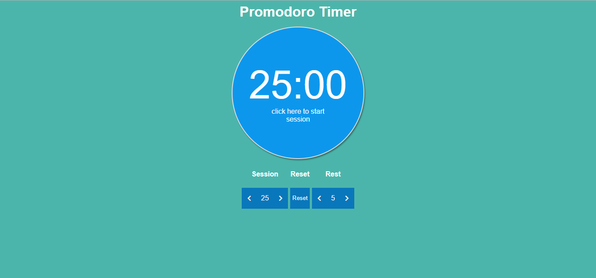

# Promodoro Clock
It is a timer that allow users to follow the promodoro technique 
manage sessions of 25:00 minutes (or the minutes you like) and rest time

## User Stories

- User Story: I can start a 25 minute pomodoro, and the timer will go off once 25 minutes has elapsed.

- User Story: I can reset the clock for my next pomodoro.

- User Story: I can customize the length of each pomodoro.

# Built with

- vuejs
- Sass
- pug
